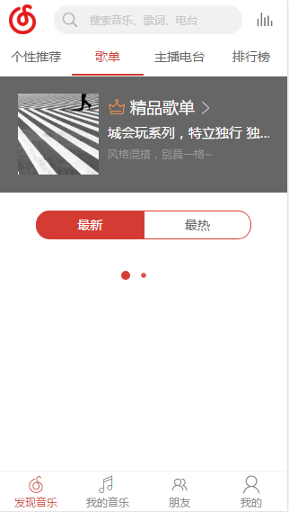
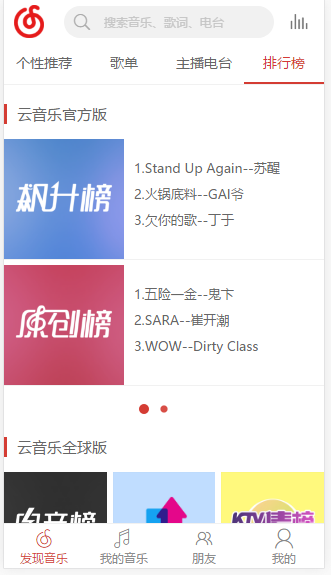
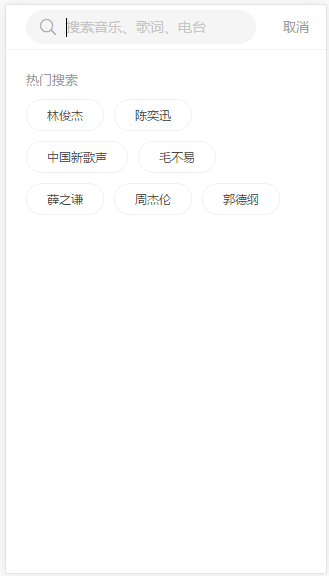
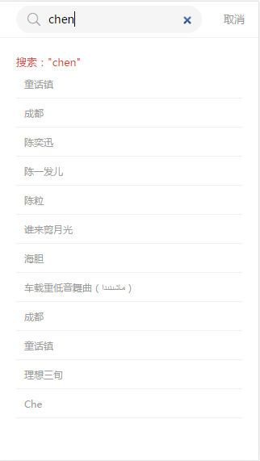
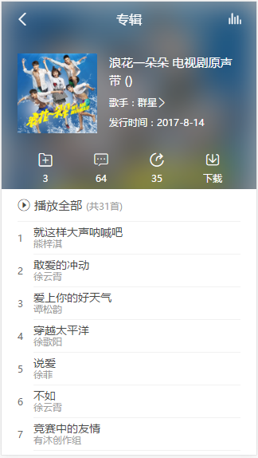

# music

> Vue仿网易云音乐app


<br/>非常感谢 Binaryify 的关于api的提供 https://binaryify.github.io/NeteaseCloudMusicApi/#/  <br/>
之前的项目都没有用过vuex,这个项目，正好播放器这一模块是全局的，所以就用了vuex尝试下<br/>
vuex并不是适合所有项目，大项目/复杂的项目还是蛮需要的<br/>
小项目，或者简单的项目，用了反而适得其反....<br/>
本项目还没完工！做到播放这一块，还有bug待修复<br/>










## Build Setup

``` bash
# install dependencies
npm install

# serve with hot reload at localhost:8080
npm run dev

# build for production with minification
npm run build

# build for production and view the bundle analyzer report
npm run build --report
```

For detailed explanation on how things work, checkout the [guide](http://vuejs-templates.github.io/webpack/) and [docs for vue-loader](http://vuejs.github.io/vue-loader).
